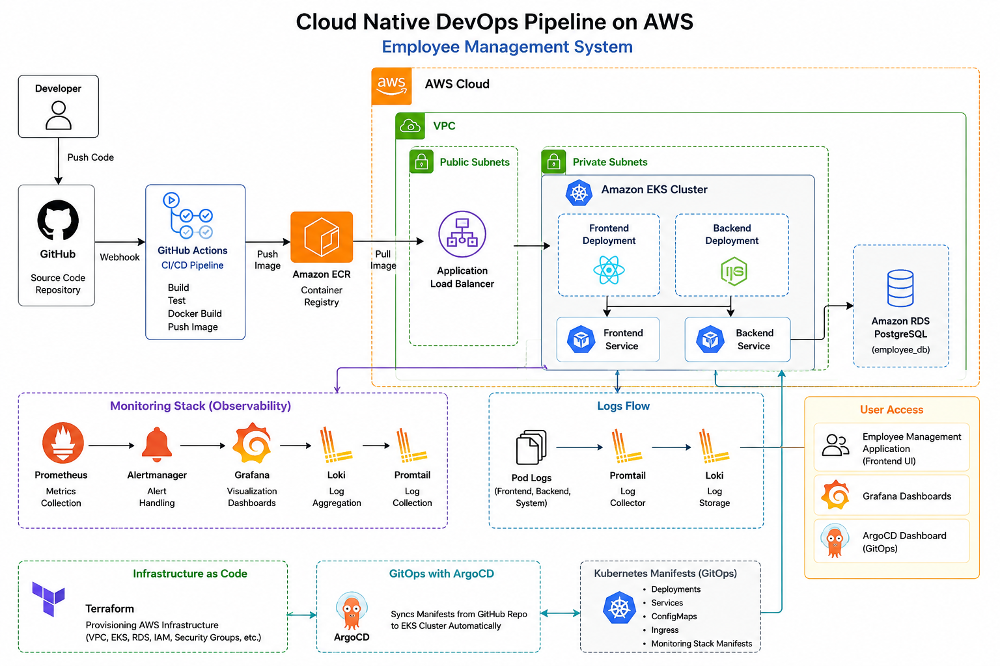
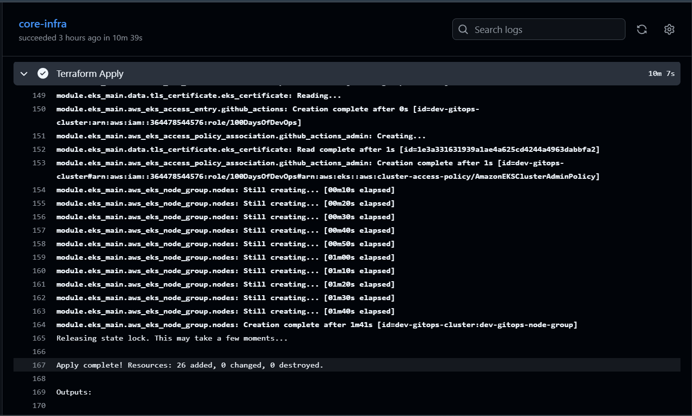
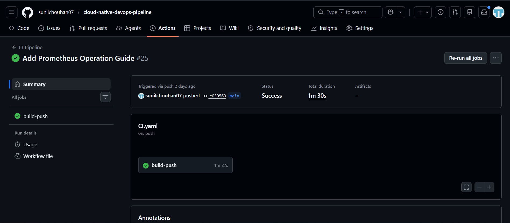
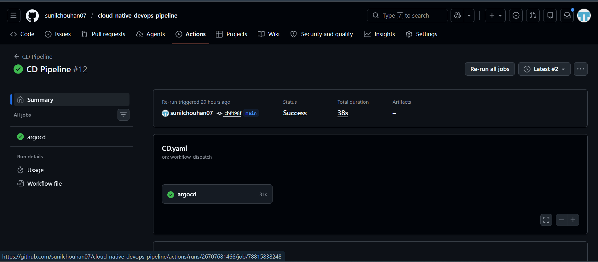
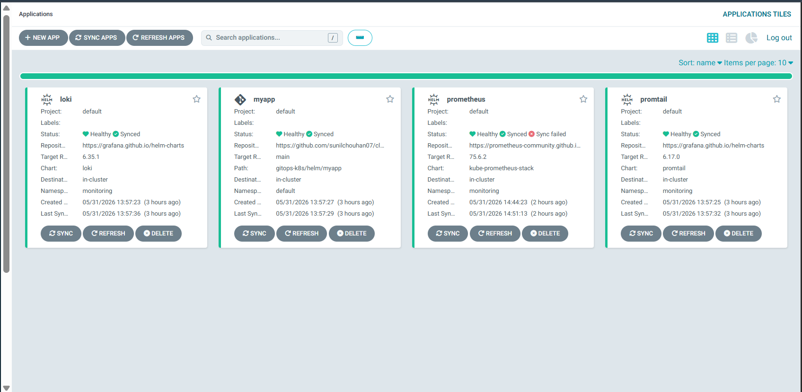
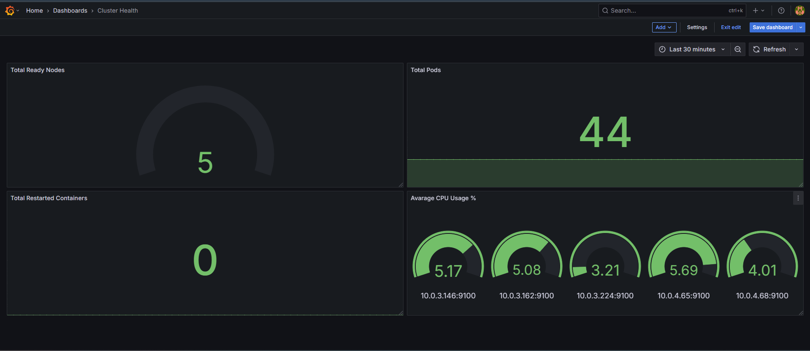
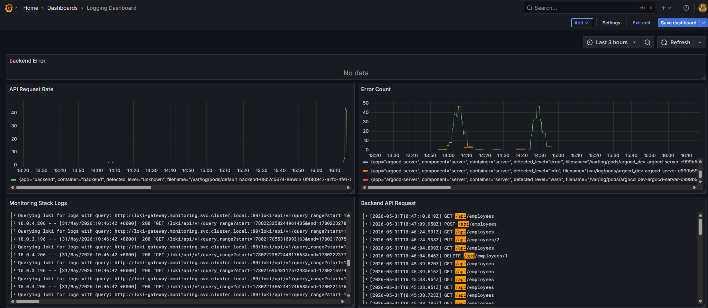
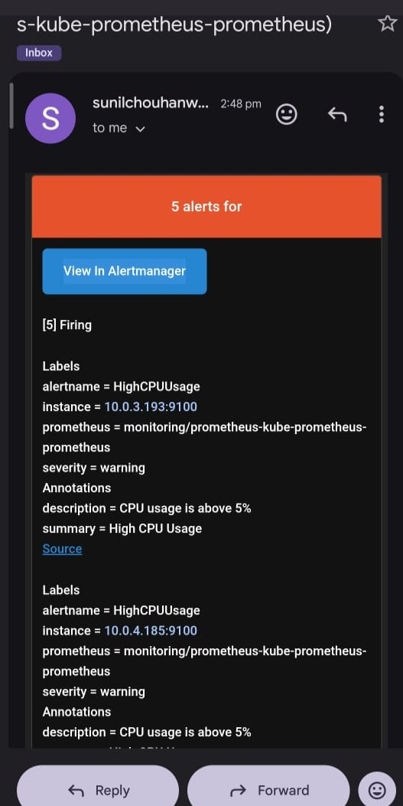
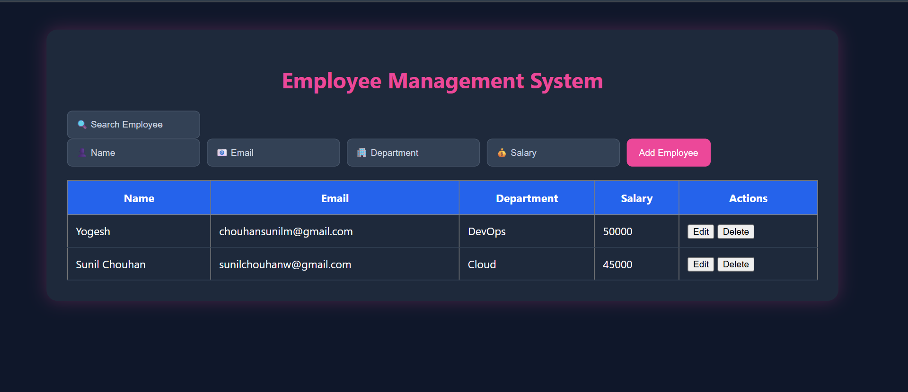

# Cloud Native DevOps Pipeline on AWS 🚀

## Overview

This project demonstrates a complete Cloud Native DevOps Pipeline deployed on AWS using modern DevOps, GitOps, Monitoring, Logging, and Infrastructure as Code practices.

The application is an Employee Management System deployed on Amazon EKS and managed through GitOps workflows with ArgoCD. The entire infrastructure is provisioned using Terraform and automated through GitHub Actions.

---


---

## Architecture



### Workflow

1. Developer pushes code to GitHub.
2. GitHub Actions CI pipeline builds and tests the application.
3. Docker images are built and pushed to Amazon ECR.
4. ArgoCD detects Kubernetes manifest changes from GitHub.
5. ArgoCD automatically syncs applications to Amazon EKS.
6. Prometheus collects metrics from cluster and applications.
7. Grafana visualizes infrastructure and application metrics.
8. Loki and Promtail collect and aggregate logs.
9. Alertmanager sends email alerts when thresholds are exceeded.

---

## Tech Stack

### Cloud

* AWS EKS
* AWS VPC
* AWS ECR
* AWS RDS PostgreSQL
* AWS IAM
* AWS Load Balancer

### Infrastructure as Code

* Terraform

## Terraform State Management

Terraform state is stored remotely in Amazon S3.

Features:

- Remote State Storage using S3
- State Locking using DynamoDB
- Team Collaboration Support
- Consistent Infrastructure State
- Protection Against Concurrent Terraform Operations

Benefits:

- Prevents state corruption
- Enables collaborative infrastructure management
- Provides centralized state storage
- Improves infrastructure reliability

### Architecture

```text
          Terraform
              ↓
          Amazon S3 (State File)
              ↓
          DynamoDB (State Locking)
```


### CI/CD

* GitHub Actions
* Docker
* Amazon ECR

### GitOps

* ArgoCD

### Monitoring

* Prometheus
* Grafana
* Alertmanager

### Logging

* Loki
* Promtail

### Application

* React Frontend
* Node.js Backend
* PostgreSQL Database

---

## Infrastructure Provisioning

Infrastructure is provisioned using Terraform.

### Core Infrastructure

* VPC
* Public Subnets
* Private Subnets
* Internet Gateway
* Route Tables
* Security Groups
* EKS Cluster
* ECR Repository
* PostgreSQL RDS

### Screenshot



### Cluster Bootstrap

* ArgoCD Installation
* Helm Provider Configuration
* Kubernetes Provider Configuration

---

## CI Pipeline

### Trigger

Git Push

### Stages

* Checkout Source Code
* Build Docker Image
* Authenticate with AWS
* Push Image to Amazon ECR

### Screenshot



---

## CD Pipeline

### Trigger

Manual Workflow Dispatch

### Stages

* Update Kubernetes Deployment Manifests
* Commit Updated Image Tag
* Push Changes to Git Repository

### Screenshot



---

## GitOps Deployment

ArgoCD continuously monitors the Git repository and automatically synchronizes application manifests with the EKS cluster.

### Features

* Automated Sync
* Self Healing
* Drift Detection
* Declarative Deployments

### Screenshot



---

## Monitoring Stack

### Prometheus

Used for:

* Node Monitoring
* Cluster Monitoring
* Application Monitoring
* Custom Metrics Collection

### Prometheus Operator CRDs

The project uses Prometheus Operator Custom Resource Definitions (CRDs) for:

- Prometheus
- Alertmanager
- ServiceMonitor
- PodMonitor
- PrometheusRule

CRDs are managed separately and deployed before the monitoring stack to ensure proper dependency handling.

### Grafana Dashboards

* Cluster Health Dashboard
* Node Monitoring Dashboard
* Application Monitoring Dashboard
* GitOps Dashboard

### Screenshot



---

## Logging Stack

### Promtail

Collects logs from Kubernetes Pods.

### Loki

Stores and indexes logs.

### Grafana

Visualizes logs through dashboards.

### Screenshot



---

## Alerting

Alertmanager is configured to send email notifications using Gmail SMTP.

### Example Alerts

* High CPU Usage
* High Memory Usage
* Pod Restart Detection
* Application Failure

### Example Rule

```yaml
- alert: HighCPUUsage
  expr: 100 - (avg by(instance) (rate(node_cpu_seconds_total{mode="idle"}[5m])) * 100) > 5
  for: 30s
```

### Email Alert Screenshot



---

## Custom Prometheus Rules

Example custom alert:

```yaml
apiVersion: monitoring.coreos.com/v1
kind: PrometheusRule
metadata:
  name: custom-alerts
spec:
  groups:
  - name: custom-alerts
    rules:
    - alert: HighCPUUsage
      expr: 100 - (avg by(instance) (rate(node_cpu_seconds_total{mode="idle"}[5m])) * 100) > 5
      for: 30s
```

---

## Application Screenshot



---

## Project Structure

```text
cloud-native-devops-pipeline
├── terraform
│   ├── Infrastructure
│   └── Cluster-Bootstrap
│
├── github
│   └── workflows
│       ├── CI.yaml
│       ├── CD.yaml
│       └── infra-provision.yaml
│
├── gitops-k8s
│   ├── applications
│   ├── helm
│   │     └── myapp
│   └── monitoring
│
└── docs
    └── images
```
---

## Documentation

Detailed operational and deployment documentation is available in the docs directory.

- docs/deployment-guide.md
- docs/gitops-workflow.md
- docs/prometheus-operation.md

---

## Key Features

* End-to-End DevOps Automation
* Infrastructure as Code using Terraform
* Remote State Management using Amazon S3
* DynamoDB State Locking
* GitOps Deployments using ArgoCD
* Continuous Integration using GitHub Actions
* Continuous Delivery Workflows
* Amazon EKS Kubernetes Orchestration
* Monitoring using Prometheus and Grafana
* Alerting using Alertmanager
* Centralized Logging using Loki and Promtail
* Custom Prometheus Alert Rules
* Self-Healing Deployments
* Automated Prometheus Operator CRD Management
* Production-Style Cloud Native Architecture

---

## Future Improvements

* Horizontal Pod Autoscaler (HPA)
* Multi-Environment Deployments
* ArgoCD Image Updater
* Slack Alerts
* SLO/SLI Dashboards

---

## Results

✅ Automated Infrastructure Provisioning using Terraform

✅ Remote Terraform State Management using Amazon S3

✅ Terraform State Locking using DynamoDB

✅ Automated CI/CD Pipeline using GitHub Actions

✅ GitOps Deployment using ArgoCD

✅ Amazon EKS Production-Style Deployment

✅ Monitoring using Prometheus and Grafana

✅ Centralized Logging using Loki and Promtail

✅ Email Alerting using Alertmanager

✅ Custom Prometheus Alert Rules

✅ Automated Prometheus Operator CRD Management

✅ Self-Healing Kubernetes Deployments

✅ Production-Ready Cloud Native Architecture

---

## Author

**Sunil Chouhan**

Cloud & DevOps Engineer passionate about AWS, Kubernetes, Terraform, GitOps, Observability, and Cloud Native Technologies.

LinkedIn: https://www.linkedin.com/in/sunil-chouhan-07a45b36b/

GitHub: https://github.com/sunilchouhan07